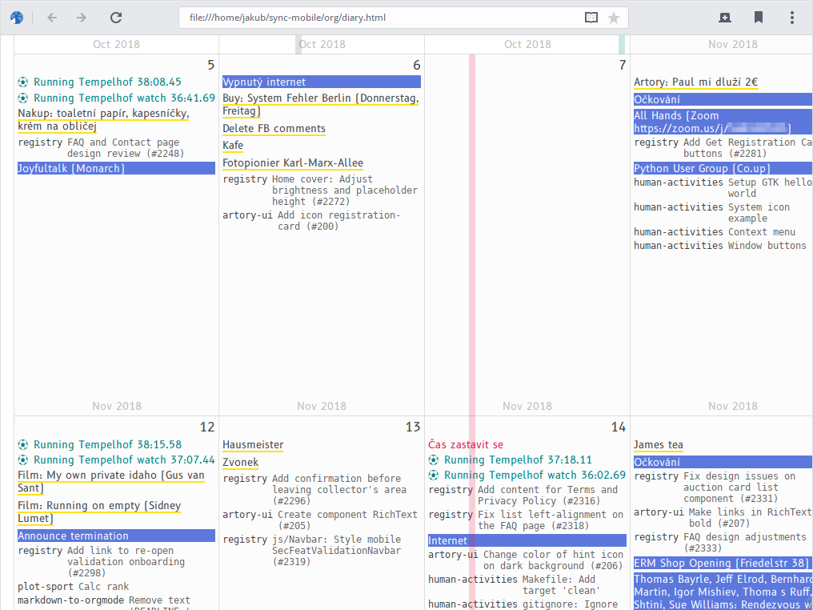

# Automatic Diary

Automatic Diary is a script that creates one timeline from various digital
sources describing your life.



_On the screenshot above, you can see: calendar events (blue), completed todo
list items (yellow), software development work (gray), sport activity (green),
and films watched (red)._

## Why

Automatic Diary can be useful to those who:

(a) have bad memory,\
(b) want to remember what they did,\
(c) but don't have the time to write a real diary.

## What is collected

- [X] Calendar events (via CalDAV service and iCalendar file reading)
- [X] Emails sent and received (via Maildir reading)
- [X] Sport activity (via spreadsheet parsing)
- [X] Facebook and Twitter posts (via Facebook/Twitter data archive parsing)
- [X] Software development work (via Git repository log)
- [X] Completed todo list items (via todo.txt parsing)
- [X] Films watched (via ČSFD website parsing)
- [X] Custom diary notes (via plain-text and Org-mode files parsing)

## What is not collected

Automatic Diary could be extended to collect also the following data but right
now it is considered low priority:

- [ ] Custom notes and ideas
- [ ] Articles and blog posts written
- [ ] Phone calls and text messages (SMS)
- [ ] Social media private messages and messaging apps
- [ ] Browser history
- [ ] Music listened (via Last.fm)
- [ ] OpenStreetMap contributions
- [ ] Money transfers
- [ ] News headlines
- [ ] Weather

## Installation

### Mac

``` shell
$ brew install python
$ pip install poetry
$ make setup
```

### Arch Linux

``` shell
# pacman -S python-poetry libsecret
$ make setup
```

### Other systems

Install these dependencies manually:

- Python >= 3.7
- poetry
- libsecret (Linux keyring) -- required by the `caldav` provider

Then run:

``` shell
$ make setup
```

## Configuration

Before you run Automatic Diary, you need to configure all the providers (sources
from which the data for your timeline will be read). The following providers are
supported:

- [caldav](#caldav)
- [csfd](#csfd)
- [csv](#csv)
- [facebook](#facebook)
- [git](#git)
- [icalendar](#icalendar)
- [maildir](#maildir)
- [orgmode](#orgmode)
- [orgmodelist](#orgmodelist)
- [todotxt](#todotxt)
- [twitter](#twitter)
- [txt](#txt)

All providers are configured using a single `config.json` file. Use
[config-sample.json](./config-sample.json) as a template for your own
configuration.

### caldav

- Input: CalDAV server

- Output: Names and locations of calendar events

- Configuration:

    ``` json
    {
        "url": "<server url>",
        "username": "<server authentication username>",
        "password_key": "<server authentication password -- libsecret key>",
        "password_val": "<server authentication password -- libsecret value>",
        "cache_dir": "<cache directory path>"
    }
    ```

### csfd

- Input: User profile on [ČSFD](https://www.csfd.cz/) (film database website, something
  like IMDB)

- Output: Titles of films rated

- Configuration:

    ``` json
    {
        "profile_url": "<csfd.cz profile url>",
        "cache_dir": "<cache directory path>"
    }
    ```

### csv

- Input: CSV spreadsheet (.csv) file

- Output: Rows formatted using a template

- Configuration

    ``` json
    {
        "path": "<csv file path>",
        "date_source": "",
        "date_format": "<strptime date format>",
        "text_source": "<template string in the Mustache format>"
    }
    ```

### facebook

- Input: Downloaded Facebook archive

- Output: Texts of statuses

- Configuration

    ``` json
    {
        "path": "<path to wall.htm or timeline.htm>",
        "username": "<facebook username>"
    }
    ```

### git

- Input: Directory with checked-out Git repositories and an author name

- Output: Commit messages by the author from all repositories

- Configuration

    ``` json
    "config": {
        "base_path": "<path to directory - will be searched recursively for git repos>",
        "author": "<author name>"
    }
    ```

### icalendar

- Input: Calendar events stored offline in iCalendar (.ics) files

- Output: Names and locations of calendar events

- Configuration:

    ``` json
    {
        "paths": [
            "<path to an .ics file>",
            ...
        ]
    }
    ```

    Not that events from all the listed .ics files will be merged -- duplicate
    events removed.

### maildir

- Input: Emails stored offline in the Maildir format

- Output: Subjects of emails

- Configuration:

    ``` json
    {
        "received_pathname": "<glob pathname of directories with received emails>",
        "sent_pathname": "<glob pathname of directories with sent emails>"
    }
    ```

### orgmode

- Input: Emacs Org-mode (.org) file in format:

        * <2019-01-17 Thu>

        Lorem ipsum
        foo.

        bar

        * <2019-01-18 Fri>

        spam spam
        ...

- Output: Example:

    ``` csv
    2019-01-17,Lorem ipsum foo.
    2019-01-17,bar
    2019-01-18,spam spam
    ```

- Configuration:

    ``` json
    {
        "path": "<path to the .org file>"
    }
    ```

### orgmodelist

- Input: Emacs Org-mode (.org) file in format:

        - Lorem ipsum foo. <2019-01-17 Thu>
        - bar <2019-01-18 Fri 11:30>
        ...

- Output: Example:

    ``` csv
    2019-01-17,Lorem ipsum foo.
    2019-01-18T11:00:00+02:00,bar
    ```

- Configuration:

    ``` json
    {
        "path": "<path to the .org file>"
    }
    ```

### todotxt

- Input: Todo.txt completed tasks file (done.txt)

- Output: Texts of completed tasks

- Configuration

    ``` json
    {
        "path": "<done.txt file path>"
    }
    ```

### twitter

- Input: Downloaded Twitter archive

- Output: Texts of tweets

- Configuration

    ``` json
    {
        "path": "<path to twitter archive directory>"
    }
    ```

### txt

- Input: Plain text (.txt) file in format:

    ```
    2015-12-02 St
        Some
        Text
        Lorem
            Ipsum
                Hierarchy
                Spam
    2015-12-03 Čt
        Foobar
        ...
    ```

- Output: Example:

    ``` csv
    2015-12-02,Some
    2015-12-02,Text
    2015-12-02,Lorem: Ipsum: Hierarchy
    2015-12-02,Lorem: Ipsum: Spam
    2015-12-03,Foobar
    ```

- Configuration

    ``` json
    {
        "path": "<path to the .txt file>"
    }
    ```

## Usage

### Generating CSV

The basic output of Automatic Diary is a CSV file. Generate it by running:

``` shell
$ ./automatic-diary <config path> <output csv path>
```

Example:

``` shell
$ ./automatic-diary ~/.config/automatic-diary/config.json ~/Desktop/automatic_diary.csv
```

The CSV output is in format:

``` csv
<datetime>,<provider>,<subprovider>,<text>
```

Example CSV output:

``` csv
2019-01-23T15:31:54-08:00,git,human-activities,model: Log exceptions while scanning
2019-01-24T09:00:00+01:00,caldav,https://dav.mailbox.org/caldav/da39a3ee5e6b,DHL Packstation
2019-01-25,todotxt,done.txt,Opravit Ondrovi kolo
```

See the help for all command line options:

``` shell
$ ./automatic-diary --help
```

### Visualization

The output CSV file can also be rendered as an HTML document which looks kind of
like a calendar. See the screenshot above. Generate this HTML document by
running:

``` shell
$ ./automatic-diary-visualize <csv path> <output html path>
```

Example:

``` shell
$ ./automatic-diary-visualize ~/Desktop/automatic_diary.csv ~/Desktop/automatic_diary.html
```

See the help for all command line options:

``` shell
$ ./automatic-diary-visualize --help
```

## Development

### Testing and linting

``` shell
$ make test
$ make lint
```

### Help

``` shell
$ make help
```

## Contributing

__Feel free to remix this project__ under the terms of the GNU General Public
License version 3 or later. See [COPYING](./COPYING) and [NOTICE](./NOTICE).
